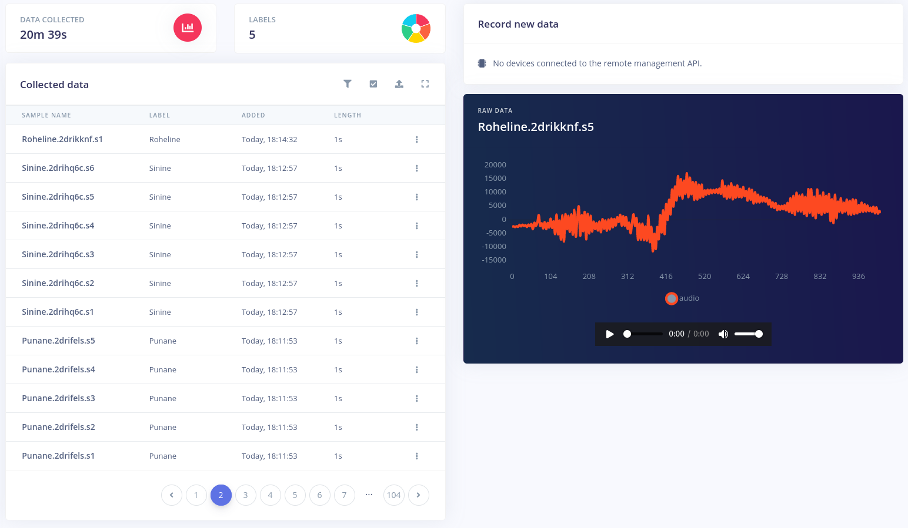

# ble33_voice_colors

Foneetiline märgusõnade tuvastamine ja eristamine mürast ja muudest sõnadest. 

Kasutatavda märgusõnad on: punane, sinine ja roheline.

## Idee

Seade, mis saab aru lihtsatest värvinimetustest ja reageerib vastavalt. Kui kasutaja ütleb _punane_ läheb põlema punane tuli, kui sinine siis sellel vastav tuli.

## Lahendus

Lahendus koosneb kahest osast. Esiteks, sügavõppe mudeli loomine ja selle kohandamine konkreetse plaadi jaoks kasutades _TinyMl/Edge Ml_ võimalusi. Ja teiseks see, kuidas mudeli tulemusi rakendada.

Andmestiku kogumise ja mudeli loomise teeb lihtsamaks [Edge Impulse](https://www.edgeimpulse.com/).

## Paigaldamist vajav tarkvara

### Nodejs paigaldamine

Lihtsaim moodus Linuxil: [allalaadida](https://nodejs.org/en/) ja lahtipakkida. Ja `.bashrc` faili lisada tee käivitusvailidele.

Näidis failist:

    export PATH=/home/taunoerik/nodejs/bin:$PATH

### Arduino CLI paigaldamine

[Allalaadida](https://arduino.github.io/arduino-cli/latest/installation/#latest-packages) ja lahtipakkida. Lisada `.bashrc` faili:

    export PATH=/home/taunoerik/arduino-cli:$PATH

### Edge Impulse CLI paigaldamine

    npm install -g edge-impulse-cli

### Muu

Lisaks Visual Studio Code ja PlatformIO.

## Andmestiku koostamine

Alati on parem koguda andmeid (antud juhul helifaili) samatüüpi seadmega, kus hiljem hakkatakse treenitud sügavõppe mudelit kasutama.

Andmestik koosneb märgendatud ja ühe sekundi pikkustest heli failidest.

Kasutatud märgendid: `Punane`, `Sinine`, `Roheline`, `unknown` ja `noise`.

### Plaadi ettevalmistamine

Viia **Arduino Nano 33 Ble Sense** alglaadimis reziimi: reset nuppu vajutada kiiresti kaks korda. Kollane tuli hakkab vilkuma.

Kataloogis [edge_impulse_firmware/arduino-nano-33-ble-sense/](./edge_impulse_firmware/arduino-nano-33-ble-sense/)

    ./flash_linux.sh

### Andmete kogumine

Terminalis käivitada Edge Impulse daemon:

    edge-impulse-daemon

Lisaks tundmatute sõnade ja müra jaoks saab kasutada seda andmestiku:

* [Keyword spotting dataset](https://docs.edgeimpulse.com/docs/keyword-spotting)

## Lingid

* [Responding to your voice](https://docs.edgeimpulse.com/docs/responding-to-your-voice)

 ___

Copyright Tauno Erik 2021 [taunoerik.art](https://taunoerik.art/)
